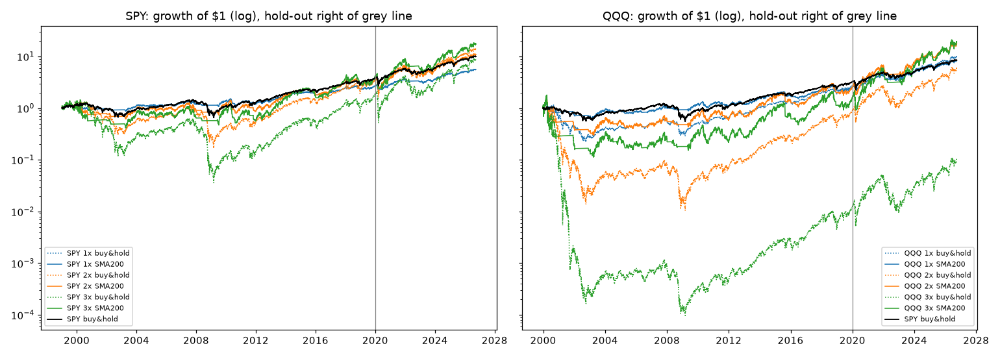

# Leveraged SPY/QQQ with the 200-day filter

Plan fixed in advance: [PREREGISTRATION.md](PREREGISTRATION.md) (committed before the first
run). All 12 pre-declared variants and the 6 robustness runs are below; nothing was dropped
or re-tuned. Reproduce with `python examples/fetch_sp500_panel.py` then
`python examples/run_leveraged_trend.py`.

## Verdict

- **No variant reliably beats SPY.** Over 1999-2019 the best headline variant, SPY 3x with
  the 200-day filter, made 6.9% a year versus 6.6% for SPY, with a -70% drawdown versus -55%.
  Every QQQ variant lost to SPY in that period.
- **The 2020-2026 hold-out looks spectacular** (QQQ 3x + filter: 43% a year versus 15% for
  SPY), but that period is a tech bull market in which plain QQQ already made 21% a year.
  Leverage multiplied a good tailwind; the filter did not create an edge.
- **The filter does what it is supposed to do on drawdowns**, and it is what makes 3x
  survivable at all: QQQ 3x buy-and-hold went to zero in 2000-2002, SPY 3x buy-and-hold lost
  97.6%. With the filter they lost 94% and 70%. Those are still drawdowns almost nobody holds
  through.
- **The result hinges on the filter length.** SPY 3x in-sample ranges from 3.3% (100-day) to
  8.7% (250-day) a year, QQQ 3x from 0.7% to 4.8%. The 200-day rule is not on a stable plateau.
- Full period 1999-2026: SPY 3x + filter 10.8% versus SPY 8.7% a year (x17 versus x10), but
  with a 3,587-trading-day (14-year) stretch under water.

## Results (CAGR / Sharpe over T-bills / max drawdown)

SPY windows start 1999-01-01. QQQ windows start 1999-12-22, the first day its 200-day
average exists; SPY buy-and-hold over that same window made 6.1% a year in-sample and 8.3% in
full.

| Variant | 1999-2019 in-sample | 2020-2026 hold-out | 1999-2026 full |
|---|---|---|---|
| **SPY 1x buy&hold (benchmark)** | 6.6% / 0.34 / -55% | 15.1% / 0.66 / -34% | 8.7% / 0.42 / -55% |
| SPY 1x SMA200 | 4.8% / 0.31 / -25% | 11.2% / 0.68 / -20% | 6.4% / 0.41 / -25% |
| SPY 2x buy&hold | 6.2% / 0.30 / -88% | 21.8% / 0.62 / -59% | 9.9% / 0.39 / -88% |
| SPY 2x SMA200 | 6.2% / 0.30 / -52% | 17.6% / 0.66 / -36% | 9.0% / 0.40 / -52% |
| SPY 3x buy&hold | 3.0% / 0.29 / -98% | 24.8% / 0.63 / -76% | 8.0% / 0.38 / -98% |
| SPY 3x SMA200 | 6.9% / 0.32 / -70% | 23.4% / 0.67 / -50% | 10.8% / 0.41 / -70% |
| QQQ 1x buy&hold | 5.1% / 0.26 / -83% | 20.7% / 0.77 / -35% | 8.9% / 0.38 / -83% |
| QQQ 1x SMA200 | 4.8% / 0.27 / -52% | 19.0% / 0.89 / -23% | 8.3% / 0.44 / -52% |
| QQQ 2x buy&hold | -0.5% / 0.27 / -99% | 31.3% / 0.74 / -64% | 6.8% / 0.37 / -99% |
| QQQ 2x SMA200 | 4.8% / 0.26 / -81% | 32.3% / 0.87 / -42% | 11.3% / 0.43 / -81% |
| QQQ 3x buy&hold | -19.7% / 0.16 / -100% | 35.0% / 0.74 / -81% | -8.3% / 0.29 / -100% |
| QQQ 3x SMA200 | 2.3% / 0.27 / -94% | 43.4% / 0.89 / -58% | 11.6% / 0.44 / -94% |

Robustness only (filter length, 3x):

| Variant | 1999-2019 | 2020-2026 | 1999-2026 |
|---|---|---|---|
| SPY 3x SMA100 | 3.3% / 0.21 / -91% | 32.0% / 0.86 / -46% | 9.8% / 0.39 / -91% |
| SPY 3x SMA150 | 4.4% / 0.25 / -81% | 25.1% / 0.71 / -51% | 9.2% / 0.37 / -81% |
| SPY 3x SMA250 | 8.7% / 0.36 / -54% | 17.1% / 0.53 / -61% | 10.8% / 0.41 / -61% |
| QQQ 3x SMA100 | 0.7% / 0.22 / -95% | 18.5% / 0.54 / -61% | 5.1% / 0.31 / -95% |
| QQQ 3x SMA150 | 1.4% / 0.24 / -98% | 45.3% / 0.92 / -59% | 11.2% / 0.43 / -98% |
| QQQ 3x SMA250 | 4.8% / 0.31 / -88% | 35.2% / 0.77 / -68% | 12.0% / 0.44 / -88% |

Volatility, longest drawdown, time invested and switch counts are in `results.json`; the
filter is invested about 75% of the time and switches about 7 times a year (195 SPY switches
in 27 years), mostly whipsaws around the average. Curves: `equity_curves.png`,
`equity_curves_SPY.csv`, `equity_curves_QQQ.csv`.

## Why leverage decays, and why the filter only partly helps

A daily-reset fund returns L times each day's move, not L times the period's move. In a
choppy market that costs roughly `L(L-1)/2 x variance` a year: at 20% index volatility that
is about 4% a year for 2x and 12% for 3x, before the 0.95% fee and the cost of borrowing
(L-1) x T-bill + spread. That is why SPY 3x buy-and-hold earned less than SPY itself over
1999-2019 despite three times the exposure. The 200-day filter steps aside in most sustained
bear markets, where volatility (and so decay) is highest, but it re-enters late and is
whipsawed in sideways markets, which at 3x is where most of the remaining damage comes from.
Both filtered 3x maximum drawdowns happened in 2000-2003 (SPY 3x: -70%, QQQ 3x: -94%), and
the filter still lost 36% (SPY 3x) and 44% (QQQ 3x) in calendar 2022. Losing years with the
filter on include 2000, 2002, 2005, 2007, 2008, 2010, 2011, 2015, 2018 and 2022 for SPY 3x.

## How the simulation works

- Prices: SPY and QQQ total-return series (dividends reinvested) from the public S&P 500
  panel. T-bill rate: FRED DTB3.
- Synthetic 2x/3x funds: `L x daily total return - (L-1) x (T-bill + 0.50%) - 0.95% fee`,
  accrued per calendar day. Checked against the real funds over 2021-10 to 2026-09 (Massive
  data, `synthetic_vs_real.json`): annual gap within half a percentage point, daily return
  correlation above 0.999.

  | Fund | Real CAGR | Synthetic CAGR | Gap |
  |---|---|---|---|
  | SSO (2x SPY) | 19.7% | 19.3% | -0.4% |
  | UPRO (3x SPY) | 22.1% | 22.6% | +0.5% |
  | QLD (2x QQQ) | 22.5% | 22.7% | +0.1% |
  | TQQQ (3x QQQ) | 23.6% | 23.5% | -0.2% |

- Trading runs through the QuantBT engine (with the PR #1 fill fixes): the signal is read on
  the close, orders fill at the next day's open, with 5 bps spread, 2 bps slippage, 5 bps
  commission and fees. Idle cash earns the T-bill rate minus 0.10%.
- 2x funds only exist from 2006 and 3x funds from 2009-2010, so everything earlier is
  hypothetical. The panel's adjusted prices come from Yahoo.
